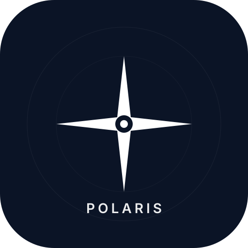

<div align="center">



# Polaris — AI Research Orchestrator

**Orchestrate research, planning, analysis and writing via Telegram — powered by Eve, Mistral and Upstash**

[](https://nodejs.org)
[](https://www.typescriptlang.org)
[](https://eve.dev)
[](https://vercel.com)
[](https://t.me/getpolaris_bot)
[](https://mistral.ai)

[Overview](#overview) • [Quick start](#quick-start) • [Telegram](#telegram) • [Architecture](#architecture) • [Configuration](#configuration) • [Usage](#usage)

</div>

Polaris is an [Eve](https://eve.dev) agent that decomposes complex requests and delegates to specialist subagents. Talk to it on Telegram (`@getpolaris_bot`) — it will research the web, plan the work, analyze data and synthesize a report while streaming live progress by editing a single status message.

> [!TIP]
> Try it now: open `t.me/getpolaris_bot` and send `Write a 500-word report on the latest AI trends, including a timeline of key milestones.` Polaris will route `planner → researcher → writer` in parallel and update the same message live.

## Overview

Complex tasks need more than one prompt. Polaris keeps the orchestrator lean and pushes specialist work to subagents — each with its own instructions, tools and sandbox. All share state via a Redis-backed scratchpad, and every session is durable across restarts.

**Use cases:** 500-word research reports, step-by-step project plans, data analysis on CSV/JSON, and any multi-step workflow that benefits from parallel research + synthesis.

## Features

- **Four specialist subagents** — `researcher` (Tavily web search + document retrieval), `planner` (decomposition), `analyst` (math & data), `writer` (synthesis) — invoked as Eve tools `researcher({message})`
- **Telegram-native** — `eve/channels/telegram` with `botUsername: getpolaris_bot`, group-mention gating, `sendMessage` chunking and live `editMessageText` progress
- **Live updates** — single message evolves: `⏳ Starting → 🔍 Researching → 🗺️ Planning → 📊 Analyzing → ✍️ Writing → final answer`
- **Shared scratchpad** — Upstash Redis (`agent/lib/redis.ts`) with in-memory fallback; `scratchpad` tool on every agent + automatic recall via `agent/memory/scratchpad.ts`
- **Durable sessions** — Eve workflow persistence keyed by `chat_id` + `message_thread_id`; conversations survive deploys
- **Per-agent models** — Mistral via `@ai-sdk/mistral` tuned per role for latency vs reasoning

## Architecture

> [!NOTE]
> **Visual:** interactive, self-contained HTML diagram at [`docs/architecture.html`](./docs/architecture.html) — open in any browser (inline SVG + CSS, no external assets). The ascii below is the GitHub fallback.

<a href="./docs/architecture.html">
  
</a>

*Open [`docs/architecture.html`](./docs/architecture.html) for the full editorial diagram (Architecture · doc-wide · 8 nodes, 11 edges) — built with the Polaris/Schematic design system (paper `#f4efe0`, ink `#202b3d`, accent `#b14a2f`, Fraunces + Inter + Space Mono, 4px grid, orthogonal `r=8` connectors).*

```
Telegram ( @getpolaris_bot ) ──POST /eve/v1/telegram──▶ Eve (Vercel)
                                                     │
                               ┌─────────────────────┼─────────────────────┐
                               │  Orchestrator        │  Shared Scratchpad  │
                               │  ministral-8b-2512   │  Upstash Redis      │
                               │  128k ctx            │  polaris:<sessionId>│
                               └──────┬──────────────┴─────────────────────┘
                                      │ delegates (tool calls, parallel)
                   ┌─────────────────┼─────────────────┐
                   │                 │                 │
          researcher              planner          analyst              writer
     mistral-small-2603    mistral-small-2603  mistral-medium-2508  mistral-small-2603
       web_search,           plans,             calculate,            synthesis
       document_retrieval    roadmaps          analyze_data
```

Isolation: subagents inherit _nothing_ from root (own tools/instructions/sandbox). Redis is the cross-agent boundary — see `agent/lib/redis.ts`. Zones (`VERCEL · EVE`, `DATA`) and legend are defined in the HTML file — legend strip at bottom covers focal/backend/store/external + HTTP/delegate/return.

## Quick start

**Prerequisites:** Node.js 24, npm, Vercel account, Telegram bot token.

```bash
git clone <your-fork-url>
cd polaris
npm install
```

Create `.env.local` (gitignored) at project root:

```bash
MISTRAL_API_KEY=...                # from console.mistral.ai
TELEGRAM_BOT_TOKEN=842349...       # from @BotFather
TELEGRAM_WEBHOOK_SECRET_TOKEN=XtUT2wDNGv63hSckemYuij0JyxzA9EPs  # A-Za-z0-9_- only, 32 chars
TAVILY_API_KEY=tvly-dev-...
UPSTASH_REDIS_REST_URL=https://...
UPSTASH_REDIS_REST_TOKEN=...
```

Run locally:

```bash
npm run dev      # eve dev — interactive TUI
# or
npm run build    # eve build
npm run typecheck
```

> [!NOTE]
> `eve dev` uses in-memory scratchpad when Upstash vars are absent. Set them to test Redis locally.

## Telegram

The channel is `agent/channels/telegram.ts`:

```ts
import { telegramChannel } from "eve/channels/telegram";
export default telegramChannel({
  botUsername: "getpolaris_bot",
  events: {
    "turn.started": /* post ⏳ + startTyping */,
    "actions.requested": /* edit to 🔍/🗺️/📊/✍️ */,
    "message.completed": /* edit to final answer */,
  },
});
```

BotFather setup for `@getpolaris_bot`:

```bash
/setname → Polaris — AI Research Orchestrator
/setabouttext → Polaris delegates to researcher, planner, analyst & writer.
/setdescription → # see README prior content
/setuserpic → upload logo-options/polaris-option1-minimal.svg (export PNG 512x512)
/setcommands →
start - Start Polaris and see what I can do
help - How to use research, planning & reports
new - Start a fresh session
report - Generate a report e.g. /report AI trends timeline
research - Search the web e.g. /research latest AI papers
plan - Create a step-by-step plan
```

**Private chats:** any text triggers the agent. **Groups:** bot wakes only on `/command`, `@getpolaris_bot` mention or reply to its message — respects BotFather privacy.

> [!IMPORTANT]
> Webhook is **POST only**. `GET https://<app>.vercel.app/eve/v1/telegram` correctly returns `404`. Telegram POSTs with `X-Telegram-Bot-Api-Secret-Token` header.

After deploying:

```bash
curl -X POST "https://api.telegram.org/bot$TELEGRAM_BOT_TOKEN/setWebhook" \
  -H "Content-Type: application/json" \
  -d '{"url":"https://polaris-ai-research-orchestrator.vercel.app/eve/v1/telegram",
       "secret_token":"'"$TELEGRAM_WEBHOOK_SECRET_TOKEN"'",
       "allowed_updates":["message","callback_query"]}'
curl "https://api.telegram.org/bot$TELEGRAM_BOT_TOKEN/getWebhookInfo" | jq
```

## Configuration

### Models

| Agent            | Model                 | Why                                               |
| ---------------- | --------------------- | ------------------------------------------------- |
| **Orchestrator** | `ministral-8b-2512`   | Fast routing/state decisions                      |
| **Planner**      | `mistral-small-2603`  | Better decomposition + structured plans           |
| **Researcher**   | `mistral-small-2603`  | Tool calling + query refinement + extraction      |
| **Analyst**      | `mistral-medium-2508` | Highest reasoning demand                          |
| **Writer**       | `mistral-small-2603`  | Strong synthesis without wasting premium capacity |

Defined in `agent/agent.ts` and `agent/subagents/*/agent.ts` via `mistral("...")` from `@ai-sdk/mistral` with `modelContextWindowTokens` (128k for 8b/medium, 32k for small) to satisfy Eve compaction.

### Environment variables (Vercel)

Set in Vercel Dashboard or `vercel env add`:

| Variable                        | Required | Where                                                                   |
| ------------------------------- | -------- | ----------------------------------------------------------------------- |
| `MISTRAL_API_KEY`               | Yes      | Mistral via `@ai-sdk/mistral`                                           |
| `TELEGRAM_BOT_TOKEN`            | Yes      | Telegram replies                                                        |
| `TELEGRAM_WEBHOOK_SECRET_TOKEN` | Yes      | Must match `setWebhook` `secret_token`, allowed chars `A-Z a-z 0-9 _ -` |
| `UPSTASH_REDIS_REST_URL/TOKEN`  | Prod     | Shared scratchpad, else in-memory fallback                              |
| `TAVILY_API_KEY`                | Optional | `web_search` tool, else returns empty with note                         |

> [!TIP]
> `AI_GATEWAY_API_KEY` is no longer used after the Mistral migration — `mistral()` calls go direct. Remove it from Vercel if you like.

## Usage

**Delegation syntax** (orchestrator → subagent):

```ts
researcher({
  message: "Search for recent quantum breakthroughs and fetch top 2 papers",
});
planner({ message: "Create 5-step plan to launch a Telegram bot on Eve" });
analyst({ message: "Calculate Q2 growth from this CSV: ..." });
writer({
  message: "Synthesize researcher + analyst outputs into executive summary",
});
```

Parallel batch: emit multiple subagent calls in one turn — Eve runs them concurrently.

**Scratchpad handoff:**

```ts
scratchpad({ operation: "write", key: "research:ai_trends", value: "..." });
scratchpad({ operation: "read", key: "research:ai_trends" });
scratchpad({ operation: "list" });
```

`agent/memory/scratchpad.ts` auto-recalls up to 20 session keys at `turn.started`.

**Example — 500-word report:**

```
User: Write a 500-word report on the latest AI trends, including a timeline of key milestones.
1. planner → outline + timeline structure → scratchpad:timeline
2. researcher (parallel) → web_search + document_retrieval → scratchpad:research:ai_trends
3. writer → reads scratchpad keys → 500-word report with citations
```

Live Telegram edits show each step. Durable `chat_id` token lets the user continue the same thread.

## Deploy on Vercel

```bash
npm run build          # sanity check
vercel link --yes --project polaris-ai-research-orchestrator
vercel env pull        # syncs VERCEL_OIDC_TOKEN
eve deploy --yes --project polaris-ai-research-orchestrator
# → https://polaris-ai-research-orchestrator.vercel.app
```

`eve deploy` handles linking and `vercel build`. Production URL is aliased to the latest deployment. See [Eve Vercel docs](https://eve.dev/docs/guides/deployment/vercel).

## Project structure

```
polaris/
├── agent/
│   ├── agent.ts                 # Orchestrator (ministral-8b-2512)
│   ├── instructions.md          # Orchestration + scratchpad + Telegram guidance
│   ├── channels/
│   │   ├── eve.ts               # vercelOidc + localDev auth
│   │   └── telegram.ts          # getpolaris_bot + live edit events
│   ├── lib/
│   │   └── redis.ts             # Upstash + fallback Map, scratchpadKey()
│   ├── memory/
│   │   └── scratchpad.ts        # Redis-backed recall provider
│   ├── subagents/
│   │   ├── researcher/ {agent.ts, instructions.md, tools/web_search.ts, document_retrieval.ts, scratchpad.ts}
│   │   ├── planner/    {agent.ts, instructions.md, tools/scratchpad.ts}
│   │   ├── analyst/    {agent.ts, instructions.md, tools/calculate.ts, analyze_data.ts, scratchpad.ts}
│   │   └── writer/     {agent.ts, instructions.md, tools/scratchpad.ts}
│   └── tools/
│       └── scratchpad.ts        # root scratchpad tool
├── logo-options/                # 3 bot avatar candidates (512x512 SVG)
├── package.json
├── tsconfig.json
└── .env.local                   # gitignored secrets
```

## Troubleshooting

**`404` on `/eve/v1/telegram` in browser** — expected, POST only. Telegram POSTs with secret header.

**`401 Unauthorized` from webhook** — `TELEGRAM_WEBHOOK_SECRET_TOKEN` in Vercel ≠ `setWebhook` `secret_token`, or contains illegal chars. Regenerate `A-Za-z0-9_-` and redeploy + reset webhook.

**`No such file compiled-agent-manifest.json` in `eve dev`** — `.eve/` was cleared (e.g., `vercel link`). Run `eve build` and restart `eve dev`.

**Model `403`/`RunInfra`** — old `minimax`/`deepseek` via AI Gateway without BYOK. This project now uses direct `mistral()` with `MISTRAL_API_KEY`.

**Pending Telegram updates stuck** — check `curl .../getWebhookInfo` → `last_error_message` and `pending_update_count`. Fix URL/secret then `setWebhook` again.

## Resources

- [Eve documentation](https://eve.dev/docs) • [Channels](https://eve.dev/docs/channels/overview) • [Telegram channel](https://eve.dev/docs/channels/telegram) • [Subagents](https://eve.dev/docs/subagents) • [Memory](https://eve.dev/docs/memory)
- [Mistral docs](https://docs.mistral.ai) • [Upstash Redis REST](https://upstash.com/docs/redis/features/restapi)
