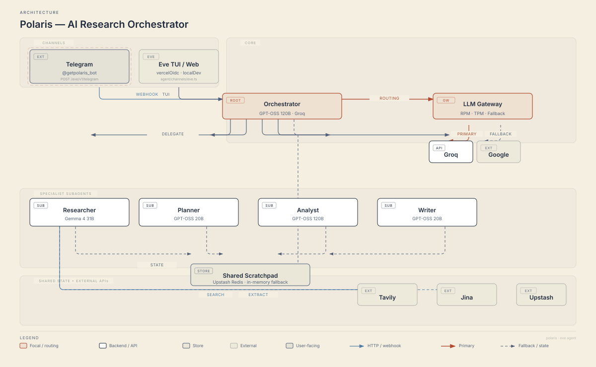

<div align="center">


# Polaris

**An AI research orchestrator for Telegram**

[](https://nodejs.org)
[](https://www.typescriptlang.org)
[](https://eve.dev)
[](https://vercel.com)
[](https://t.me/getpolaris_bot)

[Overview](#overview) | [Architecture](#architecture) | [Quick start](#quick-start) | [Telegram](#telegram) | [Configuration](#configuration) | [Deployment](#deployment)

</div>

Polaris turns a complex request into a coordinated workflow. A lightweight orchestrator delegates research, planning, analysis, and writing to specialist agents, then combines their validated results into one answer.

It is built with [Eve](https://eve.dev), runs on Vercel, uses Groq and Google AI models, and exposes a Telegram-native interface with live progress updates.

## Overview

Polaris is useful for:

- Research briefs with current sources
- Project plans, roadmaps, and checklists
- Quantitative analysis and calculations
- Reports synthesized from research and intermediate results

### Features

- Four isolated specialists: researcher, planner, analyst, and writer
- Web search and document retrieval through the researcher agent
- Redis-backed, session-scoped scratchpad for agent handoffs
- Per-agent model routing with RPM/TPM capacity tracking
- Automatic fallback and retry for provider limits
- Telegram progress messages that update throughout a workflow
- SSRF and response-size protections for document retrieval
- Private production access or an explicitly enabled public trial mode

## Architecture

<p align="center">
  
</p>

The main boundaries are:

| Layer        | Responsibility                                       | Location                                          |
| ------------ | ---------------------------------------------------- | ------------------------------------------------- |
| Channels     | Telegram webhook and Eve local/deployment access     | `agent/channels/`                                 |
| Abuse guard  | Allowlist, per-user limits, and public trial budget  | `agent/lib/telegram-guard.ts`                     |
| Orchestrator | Clarification, delegation, validation, and synthesis | `agent/agent.ts`, `agent/instructions.md`         |
| LLM gateway  | Capacity reservation, fallback routing, and retries  | `agent/lib/`                                      |
| Specialists  | Research, planning, analysis, and writing            | `agent/subagents/`                                |
| Shared state | Session-scoped scratchpad backed by Upstash Redis    | `agent/tools/scratchpad.ts`, `agent/lib/redis.ts` |

Subagents have their own instructions, tools, and models. The scratchpad is the only intentional cross-agent state boundary, and agent-facing reads are scoped to the current session.

## Quick start

### Prerequisites

- Node.js 24
- A [Groq API key](https://console.groq.com)
- A [Google AI API key](https://aistudio.google.com) for the researcher and fallback models
- A Telegram bot token for Telegram operation
- Upstash Redis for production persistence and rate limiting

Tavily and Jina are optional. Without their keys, live web search may return no results or use direct retrieval where available.

### Install

```bash
git clone <your-fork-url>
cd polaris
npm install
```

Create `.env.local` in the project root:

```bash
GROQ_API_KEY=gsk_...
GOOGLE_GENERATIVE_AI_API_KEY=...
TELEGRAM_BOT_TOKEN=...
TELEGRAM_WEBHOOK_SECRET_TOKEN=...

# Production/shared state
UPSTASH_REDIS_REST_URL=https://...
UPSTASH_REDIS_REST_TOKEN=...

# Optional research providers
TAVILY_API_KEY=tvly-...
JINA_API_KEY=jina_...
```

### Run locally

```bash
npm run dev
```

For local development, the Telegram allowlist may be omitted. The scratchpad uses an in-memory fallback when Redis is not configured.

### Verify

```bash
npm run typecheck
npm test
npm run test:security
npm run build
```

## Telegram

### Private production access

Production access is closed by default. Add Telegram numeric user IDs as a comma-separated allowlist:

```bash
TELEGRAM_ALLOWED_USER_IDS=123456789,987654321
```

The bot applies limits per Telegram user, not per chat. Production rate limiting fails closed if Redis is unavailable.

### Public trial mode

For a controlled public demo, explicitly enable the trial and leave the allowlist empty:

```bash
TELEGRAM_PUBLIC_TRIAL_ENABLED=true
TELEGRAM_TRIAL_RPM_LIMIT=20
TELEGRAM_TRIAL_RPD_LIMIT=100
```

Trial traffic must pass both the global trial budget and the per-user limits. Redis is required in production so the global budget survives serverless cold starts.

Disable the trial by setting `TELEGRAM_PUBLIC_TRIAL_ENABLED=false` and redeploying.

### Webhook setup

After deployment, register the Telegram webhook:

```bash
curl -X POST "https://api.telegram.org/bot$TELEGRAM_BOT_TOKEN/setWebhook" \
  -H "Content-Type: application/json" \
  -d '{"url":"https://<your-domain>/eve/v1/telegram","secret_token":"'"$TELEGRAM_WEBHOOK_SECRET_TOKEN"'","allowed_updates":["message","callback_query"]}'
```

The endpoint accepts POST requests from Telegram. A browser GET returning `404` is expected. In groups, Polaris responds to commands, mentions, and replies to the bot.

## Configuration

### Model routing

| Agent        | Primary              | Fallback                   | Role                                    |
| ------------ | -------------------- | -------------------------- | --------------------------------------- |
| Orchestrator | GPT-OSS 120B / Groq  | Gemma 4 31B / Google       | Workflow coordination and synthesis     |
| Analyst      | GPT-OSS 120B / Groq  | Gemma 4 31B / Google       | Calculations and quantitative reasoning |
| Planner      | GPT-OSS 20B / Groq   | Gemma 4 31B / Google       | Plans and task decomposition            |
| Writer       | GPT-OSS 20B / Groq   | Gemma 4 31B / Google       | Reports and synthesis                   |
| Researcher   | Gemma 4 31B / Google | Gemini Flash Lite / Google | Search and document extraction          |

The gateway estimates prompt and tool tokens, reserves provider capacity, routes oversized or rate-limited calls to fallbacks, and reconciles actual usage.

### Environment variables

| Variable                        | Required                | Description                                     |
| ------------------------------- | ----------------------- | ----------------------------------------------- |
| `GROQ_API_KEY`                  | Yes                     | Groq provider key                               |
| `GOOGLE_GENERATIVE_AI_API_KEY`  | Yes                     | Google AI provider key                          |
| `TELEGRAM_BOT_TOKEN`            | Telegram                | Bot token                                       |
| `TELEGRAM_WEBHOOK_SECRET_TOKEN` | Telegram                | Secret used by the webhook                      |
| `TELEGRAM_ALLOWED_USER_IDS`     | Production unless trial | Comma-separated Telegram user IDs               |
| `TELEGRAM_PUBLIC_TRIAL_ENABLED` | Optional                | Set `true` for public trial access              |
| `TELEGRAM_USER_RPM_LIMIT`       | Optional                | Per-user requests per minute; default `10`      |
| `TELEGRAM_USER_RPD_LIMIT`       | Optional                | Per-user requests per day; default `200`        |
| `TELEGRAM_TRIAL_RPM_LIMIT`      | Optional                | Global trial requests per minute; default `20`  |
| `TELEGRAM_TRIAL_RPD_LIMIT`      | Optional                | Global trial requests per day; default `100`    |
| `UPSTASH_REDIS_REST_URL`        | Production              | Upstash REST endpoint                           |
| `UPSTASH_REDIS_REST_TOKEN`      | Production              | Upstash REST token                              |
| `TAVILY_API_KEY`                | Optional                | Primary web-search provider                     |
| `JINA_API_KEY`                  | Optional                | Search fallback and document retrieval provider |

Gateway overrides such as `GROQ_RPM_LIMIT`, `GROQ_TPM_LIMIT`, `GROQ_RPD_LIMIT`, `GROQ_TPD_LIMIT`, `GEMMA_RPM_LIMIT`, and `GEMMA_TPM_LIMIT` are also supported.

## Usage

Send a natural-language request to the bot. For example:

```text
Write a 500-word report on the latest AI trends with a timeline of key milestones.
```

The orchestrator selects the smallest useful workflow and delegates to specialists. Independent subagent calls can run in parallel. Intermediate findings are passed through session-scoped scratchpad keys.

The scratchpad tool supports `read`, `write`, `append`, `list`, and `delete` operations:

```ts
scratchpad({ operation: "write", key: "research.ai_trends", value: "..." });
scratchpad({ operation: "read", key: "research.ai_trends" });
```

## Deployment

Build and deploy with Eve:

```bash
npm run build
eve link --non-interactive --project <vercel-project>
eve deploy --non-interactive --yes --project <vercel-project>
```

Before production deployment, configure the required provider keys, Telegram webhook values, and Upstash Redis. Use the private allowlist unless you intentionally need the public trial mode.

## Project structure

```text
agent/
  agent.ts                 Root orchestrator
  instructions.md          Orchestrator behavior
  channels/                Telegram and Eve channels
  lib/                     Models, gateway, Redis, guards, logging
  memory/                  Scratchpad recall provider
  subagents/               Researcher, planner, analyst, writer
  tools/                   Root tools
docs/
  architecture.svg         Architecture diagram
evals/
  *.eval.ts                Eve workflow evaluations
  *.test.ts                Executable regression suites
logo-options/              Logo candidates
```

## Troubleshooting

| Symptom                             | Likely cause                                                                      |
| ----------------------------------- | --------------------------------------------------------------------------------- |
| `404` from `GET /eve/v1/telegram`   | Expected; the Telegram webhook is POST-only                                       |
| Telegram webhook returns `401`      | Secret token does not match `TELEGRAM_WEBHOOK_SECRET_TOKEN`                       |
| Production users are rejected       | Add their IDs, or explicitly enable public trial mode                             |
| Trial requests are rejected         | Configure Upstash Redis and confirm the trial limits are not exhausted            |
| Model calls return `429`            | Provider capacity is exhausted; the gateway retries and falls back where possible |
| Scratchpad state disappears locally | Redis is not configured, so the development fallback is in-memory                 |

## Resources

- [Eve documentation](https://eve.dev/docs)
- [Eve subagents](https://eve.dev/docs/subagents)
- [Eve channels](https://eve.dev/docs/channels/overview)
- [Groq documentation](https://console.groq.com/docs)
- [Google AI documentation](https://ai.google.dev)
- [Upstash Redis documentation](https://upstash.com/docs/redis)
- [Telegram Bot API](https://core.telegram.org/bots/api)
